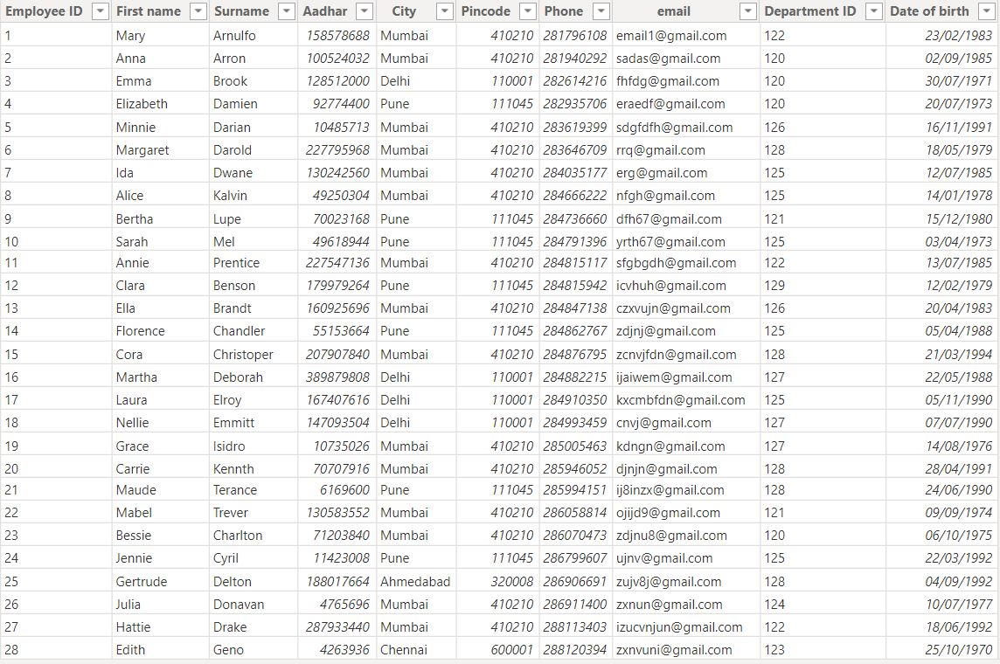
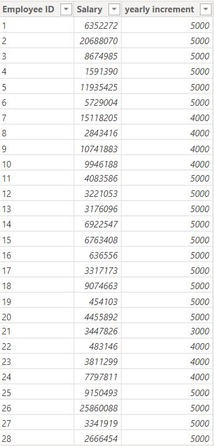
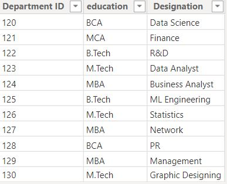
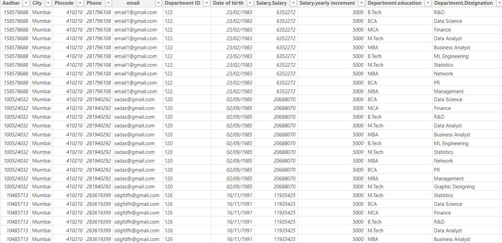

# Power-BI-Analysis-on-employee-data-set
## INTRODUCTION
This analysis on power BI is to be able to import employee data in 3 different tables, clean the data, format the data properly and merge the different data to form one comprehensive dataset with all the details
## CLEANING DATA
As part of cleaning the data, null rows where removed from each table,columns were formatted and renamed properly. Also column containing date and salary was formatted properly. See cleaned tables below

  

      

## MERGED DATA
To merge the data, firstly i meged the employee table to the salary table, using left outer join, with employee ID as the common column for merging. The resulted merged table is further merged with the department table using the department ID as the common, also using left outer join. See the resulting table below

